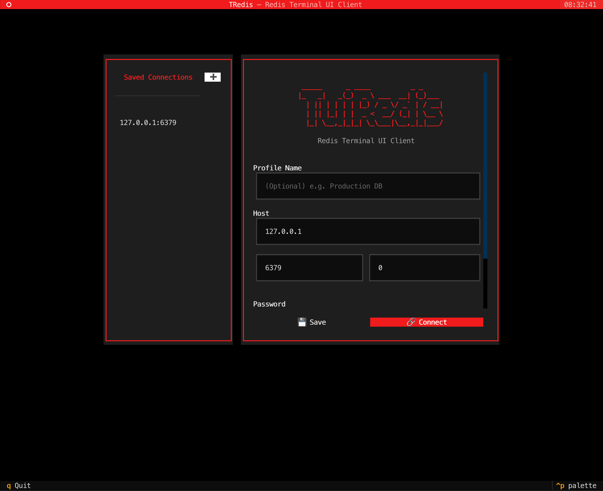
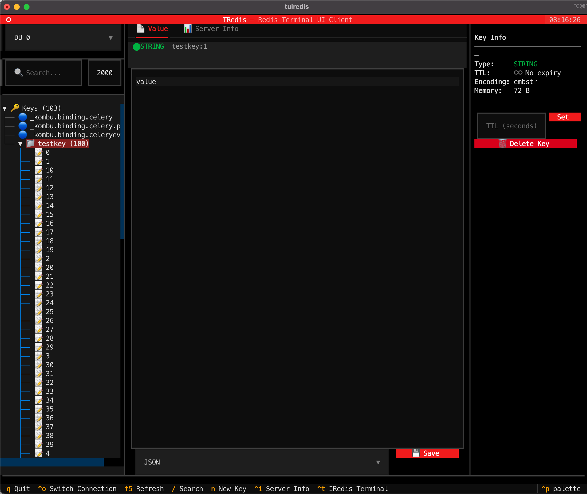

<div align="center">

# TuiRedis 🔴

A beautiful, high-performance Redis Terminal UI built with Python & [Textual](https://textual.textualize.io/).

[English](README.md) | [中文说明](README_zh-CN.md)

<br>



</div>

---

### 🚀 Features
- **🔗 Connection Management** — Connect to any Redis instance (supports Password / DB Indexing / SSH Tunnel).
- **🌲 Hierarchical Key Browser** — Interactive Tree view grouping keys by `:` separator with real-time fuzzy search.
- **⏱️ TTL Expiry Indicators** — Keys color-coded by expiry: 🔴 critical (< 60s), ⏱ expiring (< 1h).
- **☑ Multi-select & Bulk Delete** — Press `Space` on any key to select, `Ctrl+D` to delete all selected keys at once.
- **📄 Advanced Value Viewer** — Native support for viewing & editing `String`, `List`, `Hash`, `Set`, and `Sorted Set`.
- **⚡ Pagination & Elastic Loading** — Safe loading of millions of keys without blocking the TUI. Hash and Set types support cursor-based `HSCAN`/`SSCAN` pagination.
- **📋 Copy to Clipboard** — One-click copy of any String value to your system clipboard.
- **📤 Export to File** — Export any key's value to a local file (`.txt` for strings, `.json` for structured types).
- **⌨️ Command Console** — Execute raw Redis commands directly within the app.
- **📊 Server Info & Monitoring** — View exact server stats, memory footprints, connected clients, and keyspace utilization.
- **✨ CRUD Operations** — Create, Read, Update, Delete keys seamlessly.
- **🎨 Modern Dark Theme** — Redis-branded aesthetics with fluid terminal animations.
- **🛠️ IRedis Integration** — One-click launch into `iredis` terminal via internal bindings.

### 📦 Installation
TuiRedis is available on PyPI and can be installed using your preferred Python package manager.

**Using pipx (Recommended)**
```bash
pipx install tuiredis
```

**Using uvx / uv**
```bash
uvx tuiredis
# or
uv tool install tuiredis
```

**Using pip**
```bash
pip install tuiredis
```

**From Source**
```bash
# Clone the repository
git clone https://github.com/Wooden-Robot/tuiredis.git
cd tuiredis

# Sync dependencies using uv
uv sync

# Run the project
uv run tuiredis
```

### 💻 Usage
If you installed TuiRedis via `pipx` or `pip`, you can start it directly from the terminal by running `tuiredis`. If you cloned from the source, you should use `uv run tuiredis` instead.
```bash
# Launch TuiRedis with the Interactive Connection Dialog
tuiredis

# Fast connect via CLI arguments
tuiredis -H 127.0.0.1 -p 6379 -a mypassword -n 0 -c

# Connect securely via an SSH Tunnel
tuiredis -H 127.0.0.1 -p 6379 --ssh-host my-bastion.com --ssh-user root --ssh-key ~/.ssh/id_rsa -c

# Show all available CLI options
tuiredis --help
```

### ⌨️ Keyboard Shortcuts
| Key | Action |
|-----|--------|
| `q` | Quit the application |
| `F5` | Refresh Key Tree & Info |
| `/` | Focus search bar |
| `n` | Create a New Key |
| `Space` | Toggle key selection (in Key Tree) |
| `Ctrl+D` | Bulk delete all selected keys |
| `Tab` | Switch between active panels |
| `Ctrl+o`| Switch Connection |
| `Ctrl+t`| Launch IRedis Terminal (`uv` will prompt to install if missing) |
| `Ctrl+i`| Toggle Server Info Panel |

---
*Requirements: Python >= 3.10 / Redis Server*
