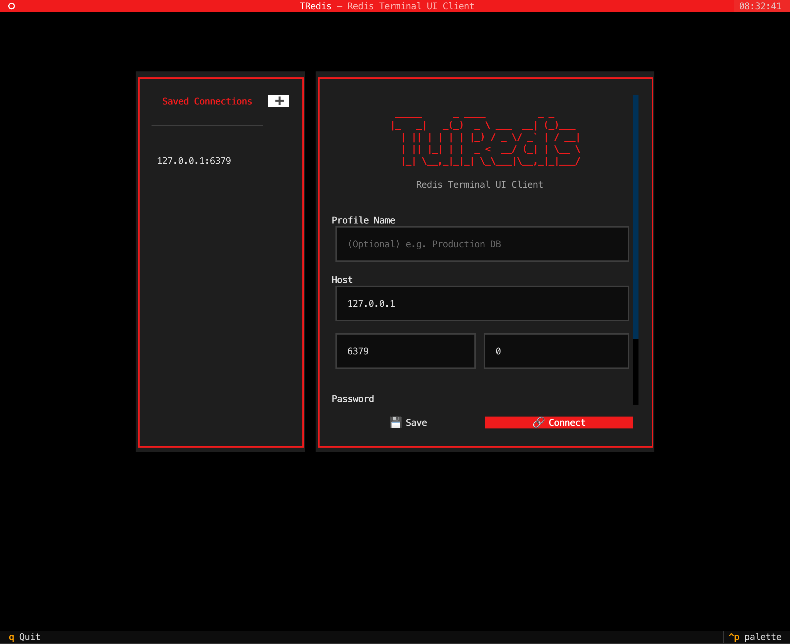
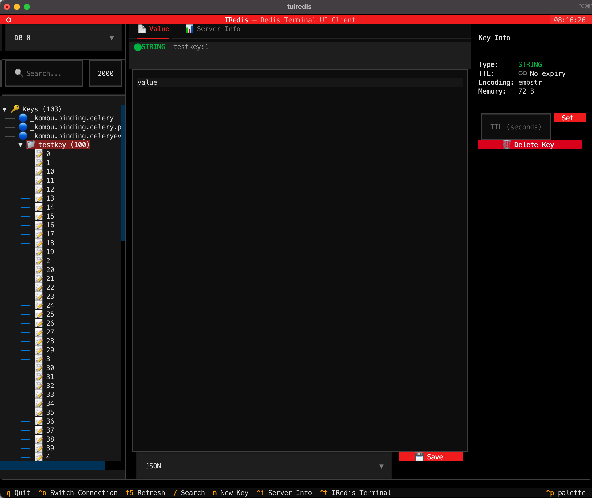

<div align="center">

# TuiRedis 🔴

一款基于 Python & [Textual](https://textual.textualize.io/) 构建的、美观且高性能的 Redis 终端可视化管理工具。

[English](README.md) | [中文说明](README_zh-CN.md)

<br>



</div>

---

### 🚀 核心特性
- **🔗 灵活的连接管理** — 支持快速连接任意 Redis 实例（支持密码验证与指定 DB 索引）。
- **🌲 层级化键值浏览器** — 树形结构自动按照 `:` 分隔符折叠 Keys，并支持实时模糊搜索过滤。
- **📄 高级数据查看器** — 原生支持完整查看及修改 `String`、`List`、`Hash`、`Set` 和 `Sorted Set` 数据结构。
- **⚡ 高性能弹性分页加载** — 利用原生 SCAN 游标，即使拥有数百万 Key 也能流畅加载不卡顿。
- **⌨️ 终端命令控制台** — 允许直接在可视化界面内执行原生 Redis 命令。
- **📊 服务器状态监控** — 实时查看 Redis 内存开销、连接客户端数量和各数据库键数量占比。
- **✨ 全功能 CRUD** — 无缝创建、读取、更新和删除键值。
- **⏱️ TTL 生命周期管理** — 直观地查看并设置 Key 的过期时间。
- **🎨 现代暗黑主题** — 沉浸式的终端 UI 体验及顺滑的动画交互。
- **🛠️ IRedis 强强联合** — 内置快捷键，一键吊起 `iredis` 交互式命令行环境。

### 📦 安装指南
TuiRedis 已经发布至 PyPI，您可以使用常用的 Python 包管理工具进行安装。

**使用 pipx (推荐)**
```bash
pipx install tuiredis
```

**使用 uvx / uv**
```bash
uvx tuiredis
# 或
uv tool install tuiredis
```

**使用 pip**
```bash
pip install tuiredis
```

**从源码安装**
```bash
# 克隆项目仓库
git clone https://github.com/Wooden-Robot/tuiredis.git
cd tuiredis

# 使用 uv 同步并安装依赖
uv sync
```

### 💻 使用姿势
```bash
# 直接启动，并在 TUI 中通过可视化弹窗输入连接信息
uv run tuiredis

# 命令行直连（适用快速启动场景）
uv run tuiredis -H 127.0.0.1 -p 6379 -n 0 -c

# 通过 SSH 隧道安全连接
uv run tuiredis -H 127.0.0.1 -p 6379 --ssh-host my-bastion.com --ssh-user root -c

# 查看所有受支持的启动参数
uv run tuiredis --help
```

### ⌨️ 快捷键列表
| 快捷键 | 功能说明 |
|-----|--------|
| `q` | 退出程序 |
| `F5` | 刷新 Key 树和服务器状态 |
| `/` | 焦点跳转至搜索框 |
| `n` | 创建新的 Key |
| `Tab` | 在不同面板区域间切换焦点 |
| `Ctrl+t`| 一键启动 IRedis 命令行 (如未安装会自动引导安装) |
| `Ctrl+i`| 切换/显示服务器详细状态信息面板 |

---
*Requirements: Python >= 3.10 / Redis Server*
